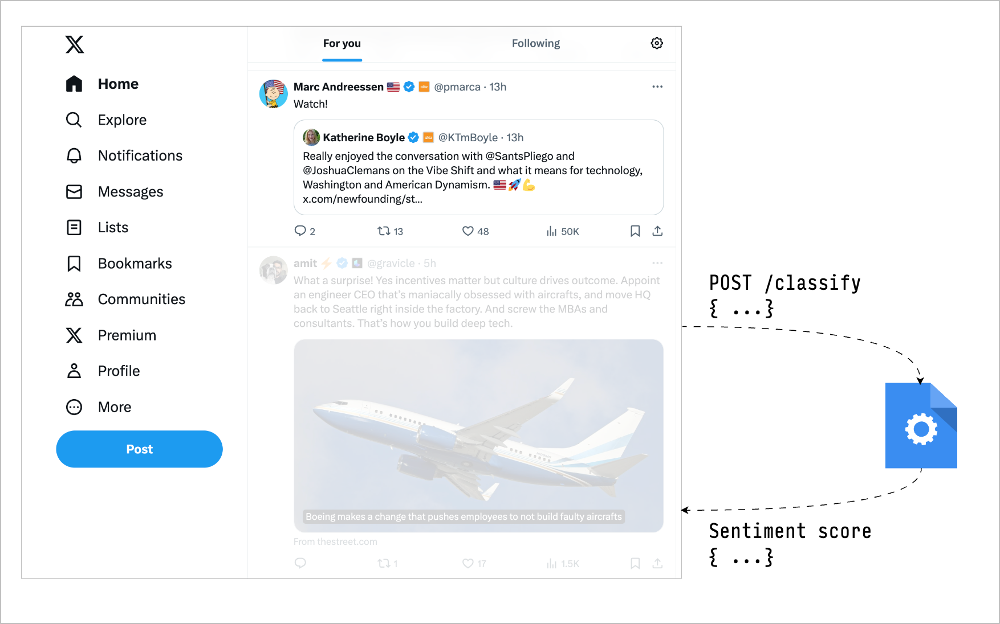

<p align="center">
  
</p>
<h1 align="center">TweetSense :: Filter tweets using sentiment analysis</h1>



## Setup

Setup Python environment.

```shell
make setup
```

Install dependencies

```shell
make deps
```

Build Chrome extension

```shell
make build-extension
```

The output will be in chrome_extension/bundled.
Use `Load unpacked` option in `chrome://extensions` to load the extension.

Run server

```shell
make run
```

# Credits

[AiFilter](https://github.com/thomasj02/AiFilter)
